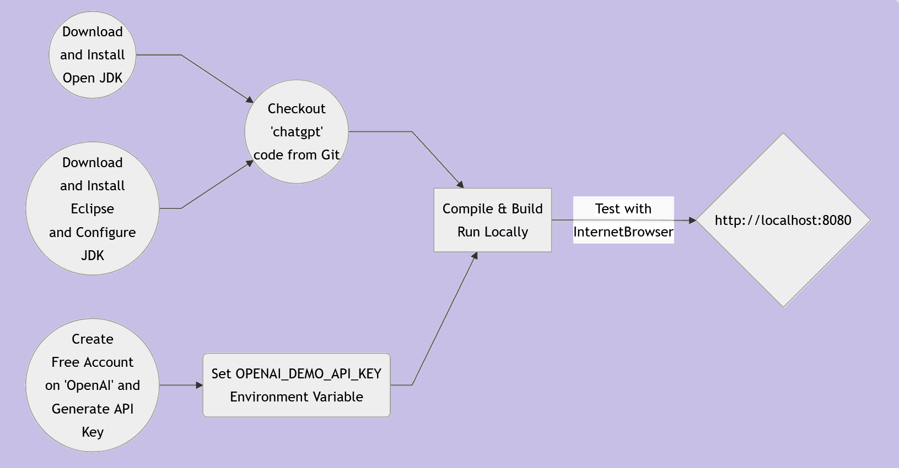
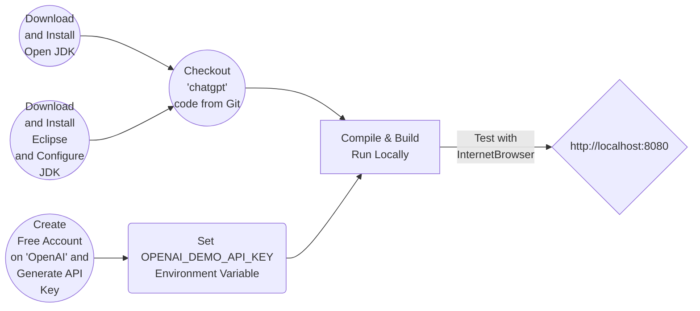

# How to Create Web ChatGPT Chatbot  using Java/JEE, Springboot, Thymeleaf, Bootstrap, HTML5, jQuery, CSS
### Workflow

### Getting Started
<ul>
<li>Download Open JDK <a href="https://openjdk.org/" target="_new">here</a> and install</li>
<li>Download Eclipse JEE IDE <a href="https://www.eclipse.org/downloads/packages/release/2022-12/r/eclipse-ide-enterprise-java-and-web-developers" target="_new">here</a>, configure JDK and install</li>
<li>Checkout <a href="https://github.com/lalumastan/chatgpt.git">this code</a> from Github</li>
<li>Create a free account on <a href="https://openai.com/" target="_new">OpenAI</a></li>
<li>Set <code>OPENAI_DEMO_API_KEY</code> environment variable </li>
<li>Compile and build the code using Eclipse</li>
<li>Run the development server using Eclipse</li>
<li>Open <a  href="http://localhost:8080" target="_new">http://localhost:8080</a> with your browser to see the result.</li>
<li><a href="https://aiweb-icsdiscover.vercel.app/" target="_new">Advanced Application Demo</a></li>
</ul>

### Tutorial

