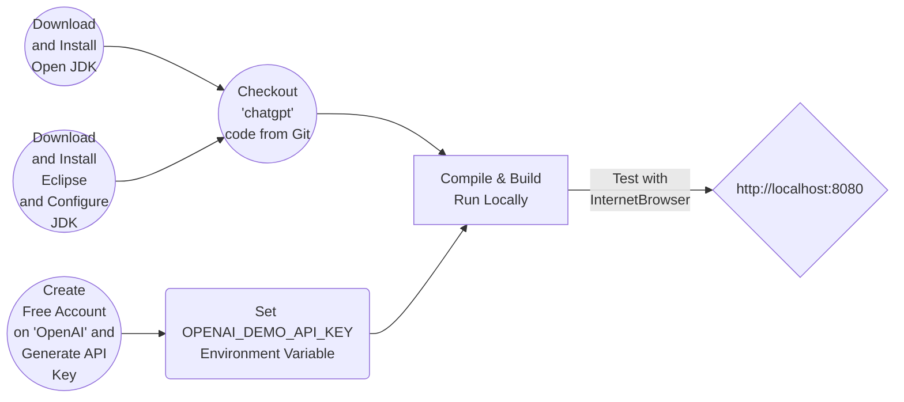

# How to Create Web ChatGPT Chatbot  using Java/JEE, Springboot, Thymeleaf, Bootstrap, HTML5, jQuery, CSS
### Workflow

### Getting Started
<ul>
<li>Download Open JDK <a href="https://jdk.java.net/21/" target="_new">here</a> and install</li>
<li>Download and install Maven as specified <a href="https://maven.apache.org/download.cgi" target="_new">here</a></li>
<li>Download Eclipse IDE for Enterprise Java and Web Developers <a href="https://www.eclipse.org/downloads/packages/" target="_new">here</a>, configure JDK and install</li>
<li><a href="https://pmd.github.io/" target="_new">Programming Mistake Detector (PMD)</a></li>
<li><a href="https://maven.apache.org/plugins/maven-pmd-plugin/index.html" target="_new">Apache PMD Plugin</a></li>
<li>Download Jenkins <a href="https://www.jenkins.io/download/" target="_new">war</a> file</li>
<li>Follow the Jenkins war installation process specified <a href="https://www.jenkins.io/doc/book/installing/war-file/">here</a> </li>
<li>Checkout <a href="https://github.com/lalumastan/chatgpt.git">this code</a> from Github</li>
<li>Create a free account on <a href="https://openai.com/" target="_new">OpenAI</a></li>
<li>Set <code>OPENAI_DEMO_API_KEY</code> environment variable </li>
<li>Compile and build the code using Eclipse</li>
<li>Run the <code>ChatGPTApplication.java</code> using Eclipse as Java Application</li>
<li>Open <a  href="http://localhost:8080" target="_new">http://localhost:8080</a> with your browser to see the result.</li>
<li><a href="https://aiweb-icsdiscover.vercel.app/" target="_new">Advanced Application Demo</a></li>
</ul>

### Tutorials
##### How to Create Web ChatGPT Chatbot using Java/JEE, Springboot, Thymeleaf, Bootstrap, HTML5, jQuery, CSS

##### How to Use Static Code Analysis Tool PMD on Web ChatGPT Chatbot using Java/JEE, Springboot, Thymeleaf, Bootstrap, HTML5, jQuery, CSS

##### How to Automate the Entire Process of Git Checkout, Maven Build, Deploy and Run ChatGPT Chatbot Web Application with Jenkins
